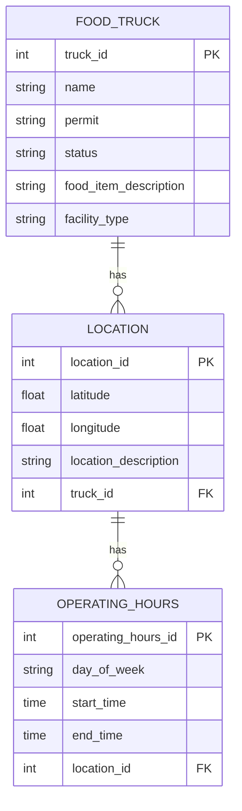

# Food Truck CSV Ingestion Tool

Welcome to the **Food Truck CSV Ingestion Tool** repository! This tool is designed to ingest CSV data and populate tables that represent the Entity-Relationship Diagram (ERD) for food trucks, locations, and their operating hours.

## Features

- **CSV Ingestion**: Import data from CSV files into the database, creating and populating tables for food trucks, locations, and operating hours.
- **Idempotent Ingestion Process**: The tool ensures that running the same CSV multiple times does not result in duplicate data, maintaining the integrity of your database.
- **Flexible Data Migration**: The ingestion tool is run as a data migration, ensuring flexibility and control over the data loading process.
- **Separate from Schema Migrations**: The ingestion process is independent of the schema migration path, offering several benefits outlined below.

## ERD Overview

The tables created by this tool correspond to the following ERD:



## Highlighted Module: `FoodTrucker.Vendor.FoodTruckImporter`

The `FoodTrucker.Vendor.FoodTruckImporter` module is at the core of the CSV ingestion process. This module is responsible for:

- **Parsing CSV Files**: Efficiently reads and parses CSV files into a structured format.
- **Data Validation**: Ensures that the data conforms to expected formats and constraints before insertion.
- **Handling Idempotency**: Implements checks to prevent duplicate records when the same CSV is processed multiple times.
- **Error Handling**: Provides detailed logging and error management, allowing for easier debugging and data integrity.

## Getting Started

To start your Phoenix server:

- Run `mix setup` to install and setup dependencies
- Start Phoenix endpoint with `mix phx.server` or inside IEx with `iex -S mix phx.server`

Now you can visit [`localhost:4000`](http://localhost:4000) from your browser.

Ready to run in production? Please [check our deployment guides](https://hexdocs.pm/phoenix/deployment.html).

## Usage

A FoodTruck CSV is already included at the path `priv/repo/data/`
To ingest CSV run the ingestion tool using a data migration:

```
 FoodTrucker.Release.migrate_data()
```

This will parse the CSV files and populate the `food_trucks`, `locations`, and `operating_hours` tables according to the ERD.

## Benefits of Separate Data Migration

Running the ingestion tool as a data migration, separate from the schema migration path, offers several benefits:

1. **Decoupled Data Logic**: By separating data ingestion from schema migrations, you can manage data-related changes independently from schema changes, allowing for more focused and isolated updates.
2. **Improved Flexibility**: This approach gives you more control over when and how data is ingested, allowing for targeted re-runs of the ingestion process without affecting the schema or other parts of the application.
3. **Easier Rollbacks**: If there’s an issue with the data ingestion, you can address it without needing to reverse any schema changes, reducing the risk and complexity of handling errors.

### What's next

1. LiveView updates
2. Upsert mechanism of location operating hours
3. And more!!
